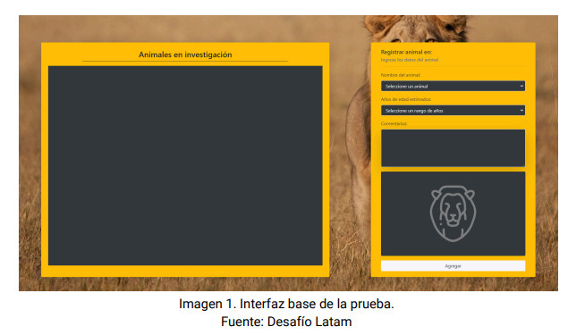
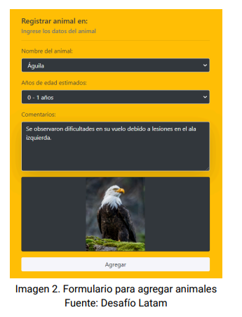
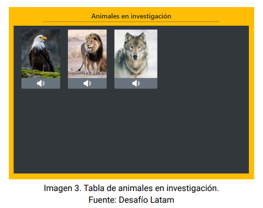
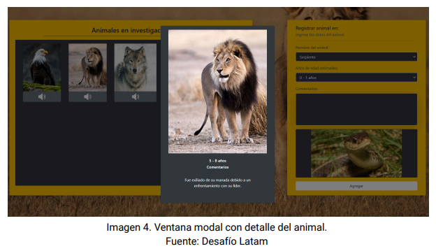
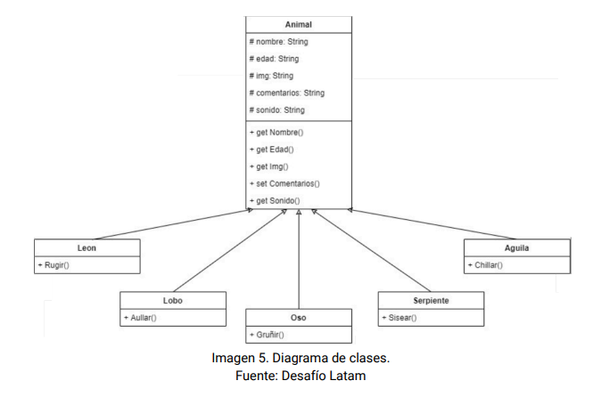

# Prueba - Programación avanzada en JavaScript

💡 Realizado [cristiandpto23](https://github.com/cristiandpto23) con HTML y JS 
➡ Front-End G17 - Desafío Latam 
🔗 Desplegado en GitHub Pages [aquí]() 

## Introducción

En esta prueba validademos nuestros conocimientos de Crear clases con herencias, Exportar e importar módulos, Crear funciones autoejecutables IIFE, Crear funciones async/await, crear instancias de clases, obtener y modificar elementos del DOM.

## Descripción

En Australia se están realizando investigaciones con algunos animales salvajes y necesitan crear un sitio web que permita registrar los comentarios de los investigadores. En esta prueba deberás crear una aplicación web que permita agregar en una tabla los animales en investigación, utilizando el paradigma POO para creación de las instancias que representen los diferentes animales con sus atributos y métodos.

A continuación diferentes imágenes que demuestran las interacciones que deberás desarrollar en la aplicación:

 

El formulario debe cumplir la función de registrar a los animales en la tabla de la izquierda.

Deberás programar la funcionalidad para agregar al animal y mostrarlo en la tabla de animales en investigación, junto con un botón que reproduzca el audio correspondiente al sonido que emite el animal agregado.

Al dar click en las imágenes de los animales debe aparecer una ventana modal con el detalle registrado del animal.

El diagrama de clases que deberás utilizar es el siguiente:

# Requerimientos

1. Crear las clases representadas en el diagrama implementando la herencia indicada.
2. Crear las instancias de las clases utilizando los datos del formulario.
3. Realizar una consulta asíncrona utilizando una función async/await para obtener las imágenes correspondientes a los animales.
4. Realizar por lo menos una función autoejecutable IIFE.
5. Dividir el código en módulos.
6. Utilizar manipulación del DOM para mostrar en la tabla los animales registrados con el formulario.
7. Validad que el usuario haya asignado todos los datos del animal antes de que éste sea agregado a la tabla.
8. Devolver el formulario en un estado inicial luego de registrar a cada animal.
9. Programar la interacción del botón de audio, en donde deberás reproducir el sonido del animal en el sitio web.
10. Mostrar el detalle de cada animal en una ventana modal al ser presionada su imagen.

## Tecnologías utilizadas

   
